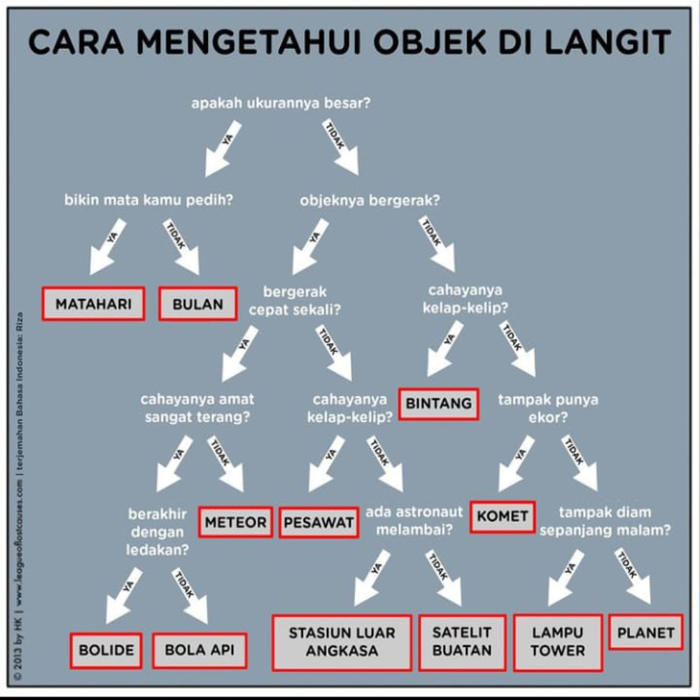

# identifikasi-benda-langit

Mini project about expert system to identify sky object using Forward Chaining.

## Diagram



## How to launch this app

- Make sure NodeJS have been installed on your device. If not installed, download [NodeJS](https://www.nodejs.org) here!.
- Clone this repository on your device
```shell
git clone https://github.com/ridlwan17/identifikasi-benda-langit # clone the repo
cd identifikasi-benda-langit # cd into the repo
```
- Launch the app by type 
```shell
node app
```
- Answer the question

**HINT** => Just follow the diagram above

## Credit

&copy; HK (The League of Lost Causes) | Translated by Riza
